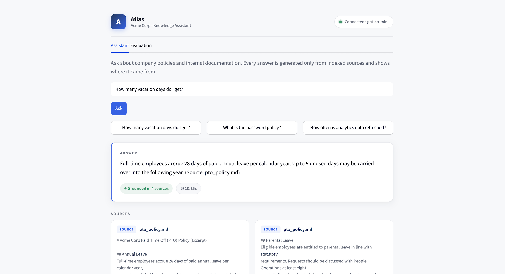
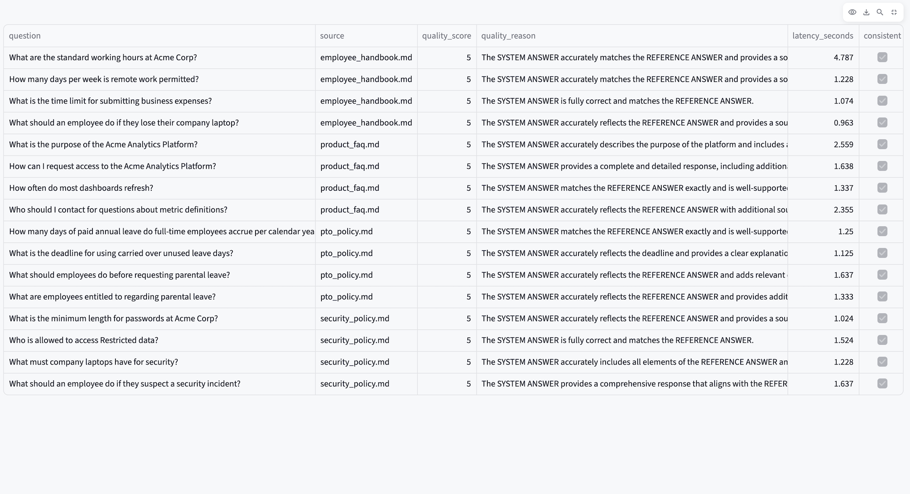

# Atlas — Enterprise RAG Assistant

A retrieval-augmented generation (RAG) assistant for enterprise knowledge retrieval,
built with **LangChain** and the **GPT-4 family**. Employees ask natural-language
questions and get answers grounded strictly in the company's own documents — with the
source passages shown alongside every answer, and a built-in evaluation harness that
measures answer quality, latency, and consistency.


> **About this repository.** A clean, public **reference implementation** of the
> architecture. It runs on a small sample document set so it is easy to clone and try;
> the pipeline is the same one designed to scale to a large enterprise corpus
> (tens of thousands of documents). Only the corpus size and the vector-store backing
> differ at scale.

---

## Demo



*Ask a question → grounded answer with a trust badge, latency, and the exact source
passages it used. Ask something outside the documents and it declines rather than
guessing.*

**Built-in evaluation:** quality, latency, and consistency on a synthetic Q&A set.



---

## Why this design

The whole point of an enterprise assistant is **trust**. A general chatbot might
confidently invent a company policy; that is unacceptable internally. Atlas answers
**only** from retrieved documents and is prompted to say it doesn't know when the
answer isn't present — so when it does answer, the answer is grounded and source-cited.

## Features

- **Grounded answers with sources.** Every response is generated only from retrieved
  passages and displays the source files it used.
- **Structured data-cleaning pipeline.** Raw documents are normalised (whitespace,
  boilerplate, control characters) before chunking, so retrieval keys on content.
- **Synthetic Q&A generation.** A GPT-4-family model reads each passage and generates
  grounded question/answer pairs, producing a labelled evaluation set without manual
  annotation.
- **Three-axis evaluation.** Response **quality** (LLM-as-judge, 1–5), **latency**, and
  **contextual consistency** (same question asked twice), with an aggregate report.
- **Polished Streamlit UI.** Assistant and Evaluation views with a clean, professional
  design.

---

## Architecture

```
 documents ─▶ clean ─▶ chunk ─▶ embed ─▶ Chroma vector store
                                              │
                              question ─▶ retrieve top-k
                                              │
                              context + question ─▶ LLM ─▶ grounded answer + sources

 Evaluation:  documents ─▶ LLM ─▶ synthetic Q&A set ─▶ run through pipeline
                                                        ─▶ judge quality
                                                        ─▶ measure latency
                                                        ─▶ check consistency
```

---

## Quickstart

```bash
git clone https://github.com/spranjal0902/enterprise-rag-assistant.git
cd enterprise-rag-assistant

python -m venv .venv && source .venv/bin/activate    # Windows: .venv\Scripts\activate
pip install -r requirements.txt

cp .env.example .env            # then edit .env and add your OPENAI_API_KEY

python scripts/build_index.py   # build the vector index from the sample documents
python -m streamlit run app.py  # launch the assistant at http://localhost:8501
```

> The project uses an OpenAI model, so an `OPENAI_API_KEY` (with billing enabled) is
> required. Running the full demo on the sample corpus costs only a few cents.

### Run the evaluation

```bash
python -m src.synthetic_qa   # generate the synthetic Q&A set from the documents
python -m src.evaluate       # score quality, latency, and consistency
```

Results are written to `data/eval/eval_results.json` and shown in the app's
**Evaluation** tab.

---

## Project structure

```
enterprise-rag-assistant/
├── app.py                     # Streamlit UI (Assistant + Evaluation)
├── requirements.txt
├── .env.example
├── .streamlit/config.toml     # UI theme
├── data/sample_docs/          # sample corpus (handbook, policies, FAQ)
├── scripts/build_index.py     # build the Chroma index
└── src/
    ├── config.py              # all tunable settings in one place
    ├── ingest.py              # load -> clean -> chunk
    ├── rag_pipeline.py        # embeddings, vector store, retriever, LLM chain
    ├── synthetic_qa.py        # synthetic Q&A generation for evaluation
    └── evaluate.py            # quality / latency / consistency harness
```

---

## Design notes

- **Grounded prompting.** The system prompt forbids answering outside the retrieved
  context and asks the model to cite source files — the main lever against
  hallucination.
- **Synthetic evaluation data.** Reference answers are generated directly from the
  source passages, so the documents act as ground truth and evaluation scales without
  hand-labelling.
- **Three axes, together.** A useful assistant must be correct, fast, and stable;
  tracking quality, latency, and consistency together prevents improving one at the
  silent expense of another.
- **Model choice.** Configured for `gpt-4o-mini` by default (cost-efficient,
  GPT-4-family). The pipeline is model-agnostic — change `CHAT_MODEL` in
  `src/config.py` to any compatible model.
- **Scaling.** For a large corpus the same pipeline swaps the local Chroma store for a
  managed/distributed vector database and batches the embedding step; retrieval,
  prompting, and evaluation code is unchanged.

## Troubleshooting

- **`ModuleNotFoundError` after install** — your virtual environment isn't active, or a
  separate (e.g. Anaconda) Python is shadowing it. Activate the venv and run tools as
  `python -m streamlit run app.py` to stay inside the project environment.
- **`model ... does not exist or you do not have access`** — set `CHAT_MODEL` in
  `src/config.py` to a model your account can use (e.g. `gpt-4o-mini`).
- **`No index found`** — run `python scripts/build_index.py` first.

## License

MIT — see [LICENSE](LICENSE).
